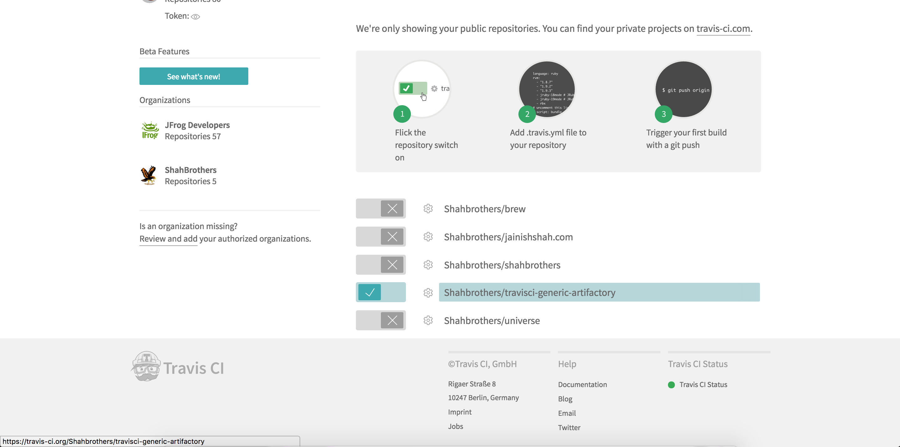
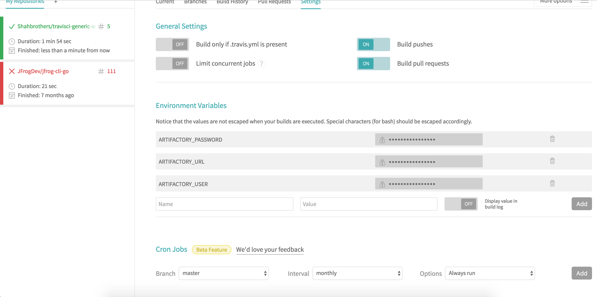
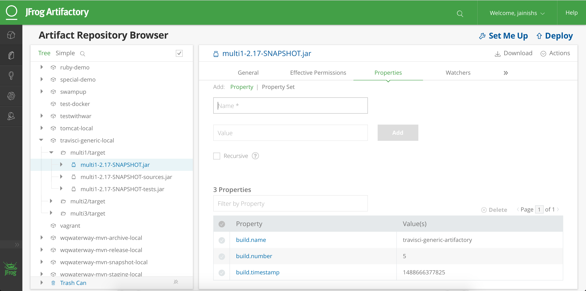
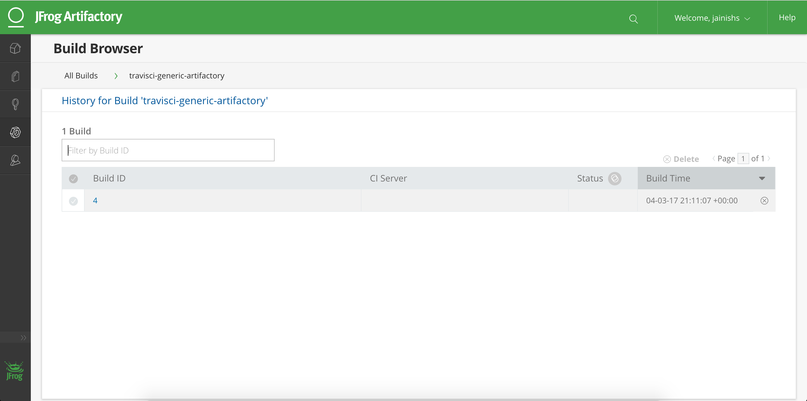

#Artifactory Integration with Travis CI using Artifactory CLI

`To make this integration work you will need to have running Artifactory-pro/Artifactory SAAS/Artifactory Enterprise which is acccessible form outside.`

##Steps to Integrate Travis CI with Artifactory.

Step 1:

copy `.travis.yml` file to your project.

Step 2:

Enable your project in TravisCI.

Step 3:

add Environment Variables ARTIFACTORY_URL, ARTIFACTORY_USERNAME and ARTIFACTORY_PASSWORD in build settings of CircleCI.

Step 5:

You should be able to see published artifacts in artifactory.

Step 6: 

Check build info in build section of Artifactory.

